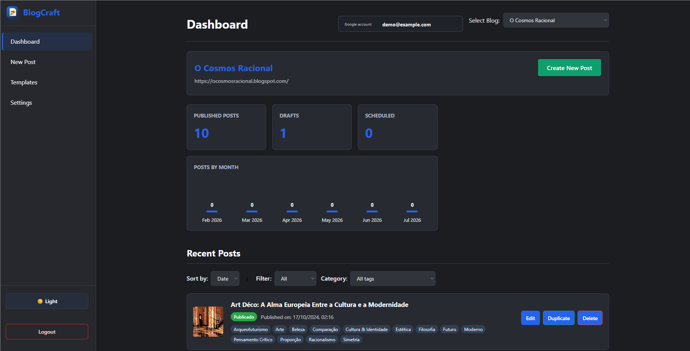
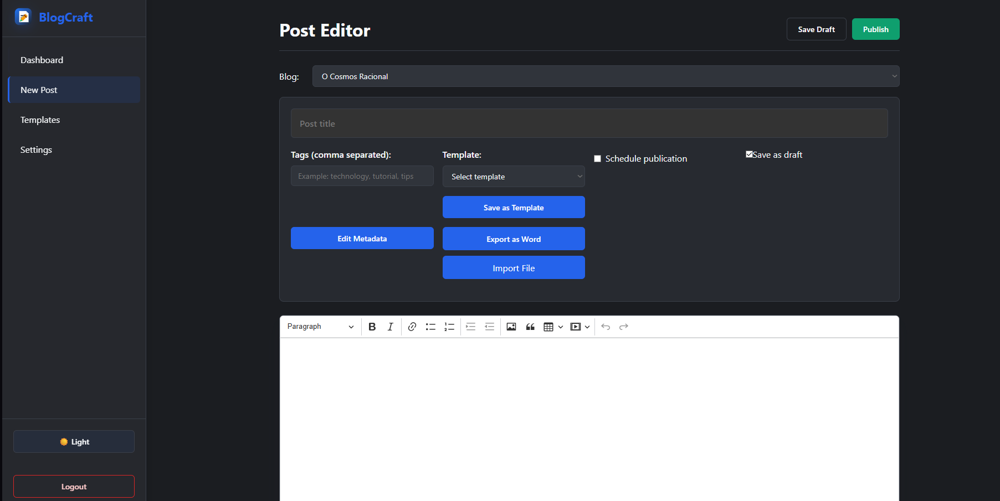
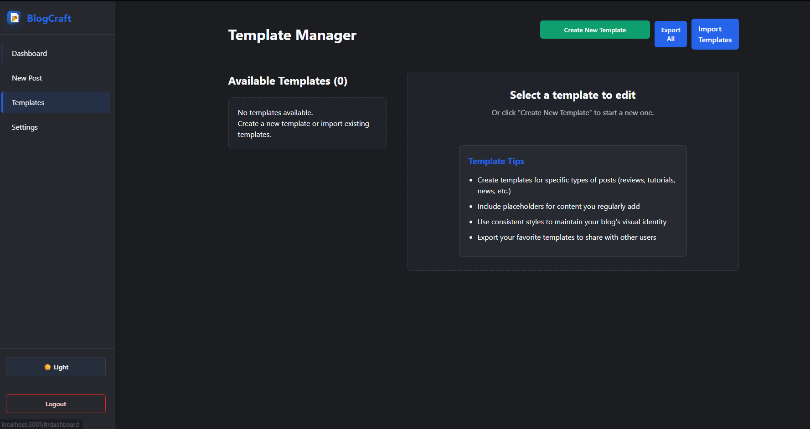

# BlogCraft - Advanced Blogger Editor

### Currently in Beta - functional portable release! ###

BlogCraft is a modern web application designed to replace discontinued tools like Open Live Writer, offering a comprehensive solution for editing and publishing on Blogger with an advanced interface and powerful features.

<p align="center">
  
</p>

<p align="center">
  
  
</p>

## Support BlogCraft

If BlogCraft saves you time, you can support development through the PayPal
donation button below.

<p>
  <a href="https://www.paypal.com/donate/?hosted_button_id=X8QF6PQEHLF6G" target="_blank" rel="noopener noreferrer">
    
  </a>
</p>

## 🆕 What's New

- **AI Assistant**: connect your own OpenAI (GPT), Google (Gemini) or
  Anthropic (Claude) API key and let the AI write, edit and illustrate posts
  directly inside the editor — via chat, quick-action buttons, or a floating
  menu over selected text.
- Text-editing fixes: working image upload (embedded as base64), image
  size/position preserved while editing, cleaned-up toolbar, word/character
  count, auto-saved draft restore, and default blog/template applied from
  Settings.
- Portable Windows release opens BlogCraft automatically and falls back to the
  next local port if `3000` is busy.
- Windows `.exe` builds include the BlogCraft logo/icon.
- Refreshed dashboard/editor/template styling and README screenshots.
- Added a PayPal donation button for project support.

## 🤖 AI Assistant (GPT / Gemini / Claude)

BlogCraft can connect to an AI provider of your choice using your own API key
or subscription. Everything runs in your browser: the key is stored only in
`localStorage` and requests go directly from your browser to the provider.

### Setup

1. Open **Settings → AI Assistant**.
2. Enable the assistant and pick a provider:
   - **OpenAI (GPT)** — key from <https://platform.openai.com/api-keys>
   - **Google (Gemini)** — key from <https://aistudio.google.com/app/apikey>
   - **Anthropic (Claude)** — key from <https://console.anthropic.com/settings/keys>
3. Paste your API key, optionally pick a model, and press **Test Connection**.
4. Save the settings.

### Using the assistant in the editor

- Click **✨ AI Assistant** in the Post Editor header to open the chat panel.
  Ask the AI to write a full article, restructure sections, fix the tone,
  add a summary, suggest a title, or insert images — the changes are applied
  directly in the text box and can be undone with `Ctrl+Z`.
- Quick-action buttons (Improve writing, Fix grammar, Continue writing,
  Add summary, Suggest title, Suggest images) run common requests in one click.
- **Select any text** in the editor to get a floating AI menu with
  *Improve*, *Fix grammar*, *Shorten*, *Expand* and *Ask AI* (free-form
  instruction). The selected fragment is rewritten in place.
- The AI can insert images, and change their position (left/center/right/side)
  and size; you can also adjust images manually with the image toolbar.

### Notes on privacy and cost

- Your API key never leaves your machine except to call the provider you chose.
- AI requests are billed to your provider account according to their pricing.
- Avoid storing API keys on shared computers.

## 🚀 Quick Start

### Downloaded portable release

For normal Windows users, the easiest path is the no-install executable:

1. Download the portable Windows `.exe` from the
   [GitHub Releases page](https://github.com/hubertdungen/blogcraft/releases).
2. Run it.
3. BlogCraft opens a browser tab automatically. If port `3000` is already busy,
   it will try the next available local port.
4. Sign in with the Google account that owns or can edit your Blogger blogs.

Normal users do not need to create a Google Cloud project, enable APIs, or edit
`.env` files. They only need to approve Blogger access during Google sign-in.
Google Authenticator is not a BlogCraft requirement; Google may still ask for
the user's normal two-factor authentication if their account has it enabled.

### Source/developer prerequisites

- Node.js 18.x or higher (recommended)
- npm (v9+) or Yarn (v1.22+)
- Google Account with Blogger access

### Run from source

1. Clone the repository
   ```bash
   git clone https://github.com/hubertdungen/blogcraft.git
   cd blogcraft
   ```

2. Install dependencies
   ```bash
   npm install
   # or
   yarn install
   ```

3. Optional local configuration
   - Copy `.env.example` to `.env` only if you want to override defaults.
   - `REACT_APP_GOOGLE_CLIENT_ID` is optional for normal local use because
     BlogCraft includes a default OAuth client ID.
   - `REACT_APP_TINYMCE_API_KEY` is also optional.

4. Run the application
   ```bash
   # On macOS/Linux
   ./run.sh

   # On Windows
   run.bat

   # Or start manually
   npm start
   ```

5. Access the application at `http://localhost:3000`

## ✨ Feature overview

- Robust Google Sign-In via `@react-oauth/google` with Blogger scope
- Token handling improvements in `AuthService` and `TokenManager` (session checks, safer storage)
- `BloggerService` with caching, timeouts, and clearer error messages (401/403/429)
- Dashboard: blog selector, recent posts, and basic monthly stats
- Post Editor (CKEditor 5): draft/publish, scheduling, labels, metadata injection, image upload with resize/position, word count, import (TXT/HTML) and export to Word
- AI Assistant: chat panel, quick actions and selection menu backed by GPT, Gemini or Claude with your own API key
- Templates Manager: create, edit, delete, and reuse content templates
- Settings: theme (dark/light), defaults, autosave/backup options, AI provider configuration
- i18n foundations (`en-US`, `pt-PT`) and improved styling

## 🔑 Authentication Guide

### Normal user login

BlogCraft uses Google OAuth to ask for Blogger permission. During login, choose
the same Google account shown in Blogger. If BlogCraft says "No blogs found",
use **Switch Google Account** and choose the account that owns or has author/admin
permission on the blogs.

The Blogger API returns only blogs where the signed-in account has authorship or
admin rights. If a blog appears in Blogger under a different Google account, it
will not appear in BlogCraft until that account is selected.

### Custom OAuth client setup

Most users should not need this section. Use it only when maintaining a public
release, running a fork, or replacing the bundled OAuth client ID.

1. **Create Google Cloud Project**
   - Visit [Google Cloud Console](https://console.cloud.google.com/)
   - Create a new project or select an existing one

2. **Enable APIs**
   - Navigate to "APIs & Services"
   - Enable "Blogger API"

3. **Create OAuth Credentials**
   - Go to "Credentials"
   - Click "Create Credentials" > "OAuth client ID"
   - Select "Web application"
   - Add authorized origins and redirect URIs
     * For local development: `http://localhost:3000`
     * For production: Your actual domain

4. **Configure Consent Screen**
   - Set up OAuth consent screen
   - Add required scopes:
      * `.../auth/blogger` (Blogger API)
      * `email`
      * `profile`

5. **Security Considerations**
   - OAuth Client IDs are public identifiers, but client secrets must never be
     used in the browser app or committed to version control
   - Keep the OAuth consent screen published/configured for the intended users
   - If the OAuth app is left in testing mode, only configured test users can
     sign in

### Troubleshooting
- Check the Google account shown at the top of the BlogCraft dashboard
- Use **Switch Google Account** if Blogger shows the blogs under another account
- Ensure your Google account has author/admin Blogger access
- Verify Client ID and scopes match your application
- Check network connectivity
- Ensure browser supports modern OAuth flows
- If you receive 401/403 errors, log out and sign in again
- The project uses `react-scripts` with `--openssl-legacy-provider` set in `npm` scripts for compatibility on Node 18

## 🧪 Build & Test

```bash
npm run build
npm test -- --watchAll=false
npm run serve
```

The production build will be created in `build/`. You can open
`build/index.html` directly to inspect the UI, but Google OAuth must run from
`http://localhost:3000` because Google does not accept `file://` as a web
origin.

## 📦 Portable Releases

Windows users can build a no-install portable executable:

```bat
build-release.bat
```

or:

```bash
npm run release
```

The Windows file is created at `dist/blogcraft-x.y.z-windows-x64.exe`.

macOS and Linux users can build a portable binary for their current OS:

```bash
./build-release.sh
# or
npm run release:current
```

Other release targets:

```bash
npm run release:win
npm run release:linux
npm run release:macos
npm run release:all
```

The release binary starts BlogCraft's local server and opens the browser
automatically. If `3000` is already in use, BlogCraft tries the next available
local port. Windows binaries include the BlogCraft icon. The first release
build may download Node runtime binaries used by `pkg`. macOS binaries are
unsigned, so Apple users may need to allow the app in macOS security settings
or run it from Terminal.

Maintainers can publish a release by pushing a version tag such as `v1.0.0`.
The GitHub Actions release workflow builds and attaches Windows, Linux, and
macOS portable binaries. macOS binaries should be built on macOS so they can be
ad-hoc signed; local Windows builds skip macOS targets.

## 📱 Android App (experimental preview)

Each release also ships `blogcraft-x.y.z-android.apk`, a native Android app
that wraps the BlogCraft interface (built with Capacitor).

- Download the APK from the
  [Releases page](https://github.com/hubertdungen/blogcraft/releases) and
  allow "install from unknown sources" when Android asks.
- The APK is self-signed for direct distribution (it is not on the Play
  Store). By default each release is signed with a fresh key, so Android may
  require uninstalling the previous version before updating. Maintainers can
  set the `ANDROID_KEYSTORE_BASE64` (+ password/alias) repository secrets to
  sign all releases with a stable key.
- **Known limitation**: Google blocks its OAuth sign-in inside embedded
  WebViews on some devices. The app applies a compatibility workaround, but
  if sign-in fails with a *"disallowed_useragent"* or similar error, the
  Android build is not yet usable on that device — a native sign-in flow is
  on the roadmap. The desktop portable builds are the stable option.

To build the APK yourself:

```bash
npm run build
npx cap sync android
cd android && ./gradlew assembleRelease
```

The result is created at `android/app/build/outputs/apk/release/`.

## 🕒 Background Scheduler Service

BlogCraft includes an optional Node.js scheduler that can publish posts at a later time even when the main UI is closed.

1. Add scheduled posts to `scheduled-posts.json` (see `scheduled-posts.example.json` for the structure).
2. Export a Blogger access token in `BLOGGER_TOKEN` and optionally set `SCHEDULED_POSTS_FILE`.
3. Run the service:
   ```bash
   npm run scheduler
   ```
The process will stay running and publish each post at its configured `publishDate`.

## 📚 More Help
- [Blogger API Documentation](https://developers.google.com/blogger/docs/3.0/getting_started)
- [Google OAuth Guide](https://developers.google.com/identity/protocols/oauth2)

## 💻 Development Tips
- Use incognito/private browsing to test login flows
- Clear browser cache if experiencing authentication issues
- Check browser console for detailed error messages

## 🛡️ Permissions
BlogCraft requires minimal permissions to:
- Read your Blogger blogs
- Create, edit, and manage blog posts
- Access basic profile information

## 🗺️ Roadmap (short-term)
- Native Google sign-in flow for the Android app
- Streaming AI responses in the chat panel
- Image upload to a hosting service (instead of base64 embedding)
- More powerful template variables and snippets
- AI-generated SEO suggestions
- Improved offline/auto-save experience

---

Developed with ❤️ for the blogging community
